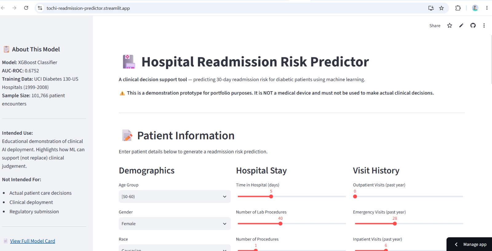
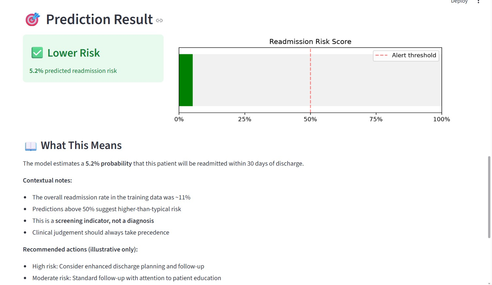
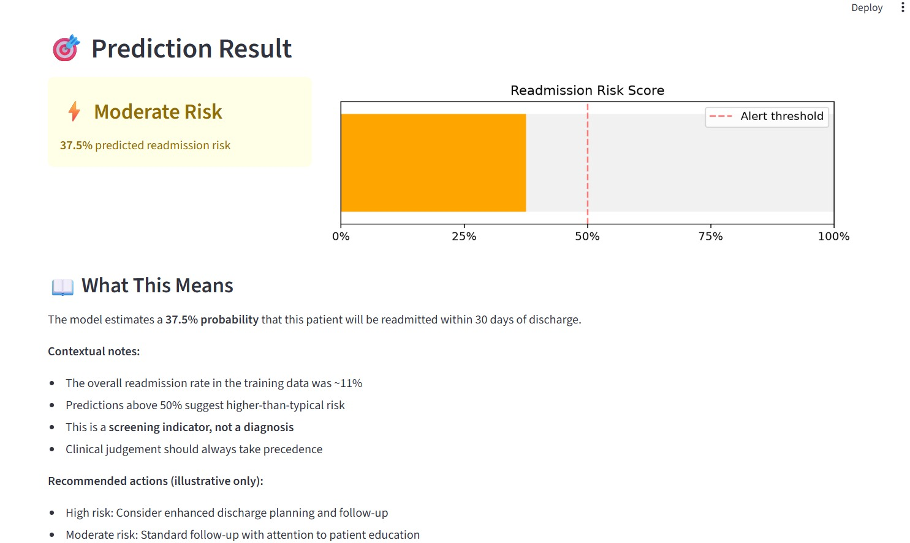
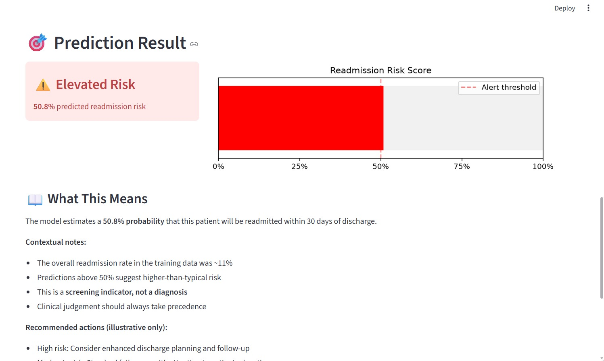

# 🏥 Hospital Readmission Risk Predictor — Deployable Clinical AI System

A **live, interactive clinical decision support tool** predicting 30-day hospital readmission risk for diabetic patients — deployed as a public Streamlit web application with formal Model Card documentation.

## 🚀 Try It Live

**👉 [tochi-readmission-predictor.streamlit.app](https://tochi-readmission-predictor.streamlit.app/)**

*Click the link above to interact with the live model — enter patient details and get real-time readmission risk predictions.*

---

## Why This Project Matters

There's a common industry saying: **"90% of ML models never make it to production."** Most portfolio projects are notebooks — analysis in isolation, disconnected from real users. This project bridges that gap by taking a trained model and delivering it as a **working, deployable web application** with proper responsible-AI governance documentation.

This project directly demonstrates:
- **End-to-end ML deployment** — from Jupyter notebook to production web app
- **Model serialisation and reproducibility** — trained artefacts saved and reloaded correctly
- **Responsible AI documentation** — a formal Model Card following the Google framework
- **User-facing design** — an interface a non-technical user could actually operate
- **Zero-cost hosting** — deployed via Streamlit Community Cloud on a public URL

---

## Project Overview

This project takes the trained XGBoost model from the [Hospital Readmission Predictor](https://github.com/TochiOkafor/hospital-readmission-predictor) portfolio project and wraps it in a full deployment pipeline:

1. **Retrained and serialised** the model with all preprocessing artefacts (scaler, label encoders, feature columns)
2. **Built an interactive Streamlit web app** with clinical-style input forms across demographics, hospital stay, visit history, clinical details, and medication status
3. **Wrote a formal Model Card** documenting intended use, performance metrics, known limitations, ethical considerations, and recommendations for real-world use
4. **Deployed to Streamlit Community Cloud** with a public URL accessible to anyone

---

## Live App Screenshots

### Main Interface

### Prediction Result — Lower Risk

### Prediction Result — Moderate Risk

### Prediction Result — Elevated Risk

---

## Technical Architecture
User Browser
↓
Streamlit Cloud (free hosting)
↓
app.py (Streamlit application)
↓
Preprocessing Pipeline (label encoders → scaler)
↓
XGBoost Model (loaded from .pkl)
↓
Prediction + Interpretation → Rendered UI

### Repository Structure
readmission-predictor-app/
├── app.py # Streamlit application
├── model_card.md # Formal Model Card documentation
├── requirements.txt # Python dependencies
├── .gitignore
├── models/
│ ├── xgboost_model.pkl # Trained model
│ ├── scaler.pkl # Fitted StandardScaler
│ ├── label_encoders.pkl # Fitted LabelEncoders per categorical feature
│ ├── feature_columns.pkl # Ordered list of training features
│ └── categorical_columns.pkl

---

## Model Details

- **Algorithm:** XGBoost Classifier
- **Task:** Binary classification — predict readmission within 30 days
- **Training Data:** [UCI Diabetes 130-US Hospitals (1999–2008)](https://archive.ics.uci.edu/dataset/296/diabetes+130-us+hospitals+for+years+1999-2008)
- **Sample Size:** 101,766 patient encounters
- **Performance:** AUC-ROC = 0.6752 on held-out test set
- **Class Imbalance:** Handled with SMOTE oversampling during training

📄 **[View Full Model Card](model_card.md)** — comprehensive documentation of intended use, limitations, fairness assessment, and deployment recommendations

---

## Key Design Decisions

### 1. Transparent Communication of Limitations
The app UI clearly communicates that this is a **demonstration prototype**, not a medical device. Every prediction is accompanied by contextual information about the training data baseline (~11% readmission rate) and reminders that clinical judgement takes precedence.

### 2. Model Card Prominently Linked
Users can click through from the app sidebar directly to the Model Card, following best practices from Google's *"Model Cards for Model Reporting"* (Mitchell et al., 2019). Real-world clinical AI deployments require documentation like this — most portfolio projects skip it entirely.

### 3. Reproducible Preprocessing Pipeline
All preprocessing artefacts (label encoders, scaler, feature order) are serialised alongside the model. This ensures the app applies exactly the same transformations that were used during training — a common source of production bugs when overlooked.

### 4. Reference to Fairness Audit
The Model Card openly references the [separate Fairness Audit project](https://github.com/TochiOkafor/healthcare-fairness-audit), which documented significant age-based disparities in this same model. This intellectual honesty about fairness limitations is what responsible AI practice looks like.

---

## Limitations

This is a demonstration prototype, not a validated clinical tool. Key limitations include:

- **Model performance is modest** — AUC-ROC of 0.6752 with very low recall on the readmitted class (~2%). Most true readmissions are missed
- **Training data is 15+ years old** — clinical practices and demographics have evolved substantially since 2008
- **Known fairness disparities** — see the [Fairness Audit](https://github.com/TochiOkafor/healthcare-fairness-audit) for full details on age, race, and gender disparities
- **US healthcare data** — not directly generalisable to UK NHS populations
- **No calibration adjustment** — predicted probabilities are overconfident and should not be interpreted as true clinical risk

---

## What Would Real Deployment Require?

Before any real-world clinical deployment, this system would need:

1. Retraining on modern EHR data with privacy protections (HIPAA/GDPR compliance)
2. Post-hoc probability calibration (Platt scaling or isotonic regression)
3. Fairness constraints applied during training
4. Prospective clinical validation study
5. Regulatory review (MHRA in UK, FDA in US)
6. Clinician-in-the-loop workflow design
7. Ongoing model monitoring for drift
8. Full penetration testing and security audit
9. Integration with hospital EHR systems (HL7 FHIR standards)
10. Formal clinical governance approval

---

## How to Run Locally

Clone the repository, create a virtual environment, install dependencies, and run:

- `git clone https://github.com/TochiOkafor/readmission-predictor-app.git`
- `cd readmission-predictor-app`
- `python -m venv venv`
- `venv\Scripts\activate` (Windows) or `source venv/bin/activate` (Mac/Linux)
- `pip install -r requirements.txt`
- `streamlit run app.py`

The app will open in your browser at `http://localhost:8501`.

---

## Related Portfolio Projects

This project builds on and complements other work in my healthcare AI portfolio:

- 🏥 [Hospital Readmission Predictor](https://github.com/TochiOkafor/hospital-readmission-predictor) — original modelling notebook that produced the underlying model
- ⚖️ [Healthcare Fairness Audit](https://github.com/TochiOkafor/healthcare-fairness-audit) — fairness assessment of this same model across race, gender, and age
- 🚨 [Sepsis Early Warning LSTM](https://github.com/TochiOkafor/sepsis-early-warning-lstm) — time-series deep learning with attention-based explainability
- 📋 [Clinical Notes Classifier](https://github.com/TochiOkafor/clinical-notes-classifier) — NLP for medical text classification

---

## Tools & Libraries

---

## Contact

Built by **Tochukwu Okafor** — AI researcher working on machine learning for healthcare.

- 🌐 [LinkedIn](https://linkedin.com/in/contacttochukwuedith)
- 💻 [GitHub](https://github.com/TochiOkafor)
- 
